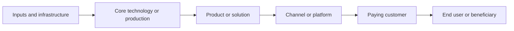

# Output Templates

Use only the components proportional to the user's purpose. Do not force a long report when a compact map answers the question.

## Executive model

In one page or less, answer:

1. What is the industry boundary?
2. Who funds it, and where does cash go?
3. Where is indispensable value created?
4. Who captures profit, and what creates their power?
5. Who bears risk, and who can transfer it?
6. What could change the structure?
7. What is the most important current conclusion and the most important unknown?

## Integrated actor table

| Actor or layer | Customer / payer | Value created | Revenue model | Profit quality | Source of power | Capital intensity | Main risk | Risk-transfer ability |
|---|---|---|---|---|---|---|---|---|

## Money map

Show operating, capital, public, and cross-subsidy funding separately. Mark the ultimate payer, billing controller, settlement node, working-capital burden, and major uses of cash.

## Value-chain map

Use Mermaid when supported:

Add regulators, standards, data providers, complements, or finance only where they change the system.

## Profit and power table

| Layer | Revenue pool | Margin / return | Capital and inventory | Pricing power | Durable moat | Why profit stays or leaves |
|---|---|---|---|---|---|---|

## Risk-allocation matrix

| Risk | Trigger | First bearer | Transmission path | Transfer mechanism | Ultimate bearer | Loss magnitude | Compensation |
|---|---|---|---|---|---|---|---|

## Change mechanism

For each major driver:

`driver → affected variable → actor response → flow change → structural result → profit/risk migration → winners/losers → leading indicator`

## Evidence ledger

| ID | Claim | Type | Evidence and source | Date | Geography / definition | Confidence | Gap or conflict |
|---|---|---|---|---|---|---|---|

## Final gaps

List unresolved questions in decision priority order. For each, name the conclusion it could change and the best primary or near-primary source to consult next.
